# Claim 169 QR Code Support (Draft)

Inji Certify now includes support for generating and embedding QR codes in Verifiable Credentials (VCs). This feature enhances the usability and accessibility of digital credentials by allowing easy scanning and verification through QR code technology.

## Key Features
- **QR Code Generation:** Inji Certify can generate QR codes that encapsulate the essential data of a Verifiable Credential.
- **Embedding in Credentials:** The generated QR codes can be embedded directly into the visual representation of the credential, making it easy for users to present and share their credentials.
- **Customizable QRs:** Administrators can configure the data encoded in the QR codes to meet specific requirements.

## How to Use QR Code Support
1. **Enable QR Code Feature:** To enable QR code support, ensure that while adding the credential configuration, proper QR code template should be added in the `qr_settings` column of `credential_config` table.
*Eg:*
    ```json
    [
      {
        "Full Name": "${fullName}",
        "Phone Number": "${mobileNumber}",
        "Date Of Birth": "${dateOfBirth}"
      }
    ]
    ```
2. **Issue Credentials with QR Codes:** When issuing a Verifiable Credential, ensure that the VC template should have placeholders for the QR code with proper labels.
*Eg:*
    ```json
    {
      "credentialSubject": {
        "id": "${_holderId}",
        "fullName": "${fullName}",
        "mobileNumber": "${mobileNumber}",
        "dateOfBirth": "${dateOfBirth}",
        "identityQRCode": $claim_169_values[0]
      }
    }
    ```
3. **Scan and Verify:** Users can scan the QR code using compatible devices to quickly access and verify the QR code and extract the identity data.

## Enabling QR Code Feature
To enable QR code support in your credential configurations, you need to include the `qrSettings` object in your credential configuration JSON.

1. `credential_config` has a column named `qr_settings` of type `jsonb`. It is an optional field. It accepts a list of objects as a value such that each object corresponds to a single QR-code data.
2. Additionally, `credential_config` also contains `qr_signature_algo` column which accepts String values. The value of this column should be a valid signature algorithm supported by Inji Certify for signing the QR code data. This field is also optional.
3. If the `qr_settings` field is not provided during the creation of a credential configuration, QR code generation will be disabled by default for that configuration.
4. If the `qr_settings` field is provided, then QR code will be signed using the algorithm specified in `qr_signature_algo`. If `qr_signature_algo` is not provided, a `signature_algo` will be used to sign the QR code.
5. Below is an example of how to include `qr_settings` and `qr_signature_algo` in your credential configuration JSON:
```json
{
  "credentialFormat": "vc+sd-jwt",
  "qrSettings": [
    {
      "Full Name": "${fullName}",
      "Phone Number": "${mobileNumber}",
      "Date Of Birth": "${dateOfBirth}"
    },
    {
      "Face": {
        "Data": "${face}",
        "Data format": "Image",
        "Data sub format": "JPEG"
      },
      "Full Name": "${fullName}",
      "Date Of Birth": "${dateOfBirth}"
    }
  ],
  "qr_signature_algo": "ES256"
}
```
6. The qrCode data will be evaluated by merging velocity template with the velocity context map containing the same data provided by the data provider plugin for the credential issuance.
7. The velocity template will look like below for integrating the QR code data with the VC (This is with reference to the above `qrSettings` example):
```json
{
        "@context": [
            "https://www.w3.org/2018/credentials/v1",
            "https://piyush7034.github.io/my-files/farmer.json"
        ],
        "issuer": "${_issuer}",
        "type": [
            "VerifiableCredential",
            "FarmerCredential"
        ],
        "issuanceDate": "${validFrom}",
        "expirationDate": "${validUntil}",
        "credentialSubject": {
            "id": "${_holderId}",
            "fullName": "${fullName}",
            "mobileNumber": "${mobileNumber}",
            "dateOfBirth": "${dateOfBirth}",
            "gender": "${gender}",
            "state": "${state}",
            "claim169": {
              "identityQRCode": "$claim_169_values[0]",
              "faceQRCode": "$claim_169_values[1]" 
            }
        }
    }
```
8. In the above example, `identityQRCode` and `faceQRCode` are the fields in the credential subject where the generated QR code data will be embedded. The `$claim_169_values` is a list that contains the generated QR code data corresponding to each object defined in the `qrSettings`.
9. After the qrSettings block is processed with the velocity context map, it creates a list of QR code data objects. Each object in this list is generated from one entry in the qrSettings array. For example, if your qrSettings looks like this:
```json
    [
      {
        "Full Name": "ABCD",
        "Phone Number": "1234567890",
        "Date Of Birth": "1990-01-01"
      },
      {
        "Face": {
          "Data": "<base64-encoded-image-data>",
          "Data format": "Image",
          "Data sub format": "JPEG"
        },
        "Full Name": "ABCD",
        "Date Of Birth": "1990-01-01"
      }
    ]
```
 - The velocity context map provides these values:
```json
    {
        "fullName": "John Doe",
        "mobileNumber": "9876543210",
        "face": "<base64-image-data>"
    }
```

 - The resulting list of QR code data objects will be:
```json
    [
      {
        "Full Name": "John Doe",
        "Phone Number": "9876543210",
        "Date Of Birth": "1990-01-01"
      },
      {
        "Face": {
          "Data": "<base64-image-data>",
          "Data format": "Image",
          "Data sub format": "JPEG"
        },
        "Full Name": "John Doe",
        "Date Of Birth": "1990-01-01"
      }
    ]
```

10. This list of QR code data objects will then be integrated with pixel-pass to generate claim-169 unsigned QR payload.
```json
    [
      "<claim169-mapped-data-payload-1>",
      "<claim169-mapped-data-payload-2>"
    ]
```
11. Each QR code payload will be signed with the `cwtSign` method of `CoseSignatureService` in Keymanager using the specified signature algorithm to produce a signed CWT in hex format.
```json
    [
        "<CWT-Hex-1>",
        "<CWT-Hex-2>"
    ]
```
12. The signed CWT hex values are again converted into base45 qr code format by using the `generateQRData` method of pixel-pass library.
13. These signed qr-codes are added to the `claim_169_values` list in the same order as defined in the `qrSettings`
```json
    [
        "<Base45-QR-Code-1>",
        "<Base45-QR-Code-2>"
    ]
```
14. Finally, these qr-codes can be integrated into the VC template under `claim169` key which is map data structure. Here the keys are the QR Code labels that can be used by wallet. The values are the respective signed QR codes in base45 format. Check below example for ref: 
```json
{
  "credentialSubject": {
    "...keys": "...values",
    "claim169": {
      "identityQRCode": "<Base45-QR-Code-1>",
      "faceQRCode": "<Base45-QR-Code-2>"
    }
  }
}
```

**Extensibility**
- Currently, QR code signing method is implemented as the default implementation in the base class: `io.inji.certify.credential.Credential`.
- The QR code signer method can be overridden in `W3CJsonLD`, `SDJWT` and `MDocCredential` classes if any specific implementation is required for QR code signing for a particular credential format in the future.
- Add custom headers or claims to the QR code payload by updating the protective headers map.

**Sequence Diagram**

```mermaid
sequenceDiagram
    participant CredentialAPI as 🔗 Credential API
    participant VelocityTemplatingEngine as ⚙️ Velocity Templating Engine
    participant Credential as 🏭 Credential
    participant PixelPass as 🟦 PixelPass
    participant KeyManager as 🟧 KeyManager

    CredentialAPI->>VelocityTemplatingEngine: Prepare template params
    VelocityTemplatingEngine-->>CredentialAPI: Return evaluated params

    CredentialAPI->>Credential: createQRData(params, templateName)
    Credential-->>CredentialAPI: Return QR data array

    alt QR data present
        loop For each QR data object
            CredentialAPI->>PixelPass: Generate unsigned claim169 payload
            PixelPass-->>CredentialAPI: Return unsigned claim169 payload
            CredentialAPI->>Credential: signQRData(claim169Payload, qrSignAlgorithm, appID, refID, didUrl)
            Credential->>KeyManager: cwtSign(cwtSignRequest)
            KeyManager-->>Credential: Return signed QR data
            Credential-->>CredentialAPI: Return signed QR data
            CredentialAPI->>PixelPass: generateQRData(cwtHex)
            PixelPass ->> CredentialAPI: Return base45 encoded QR code data
            CredentialAPI ->> CredentialAPI: Add signed QR data to claim_169_values
        end
    else No QR data
        CredentialAPI->>CredentialAPI: Skip QR signing
    end
```


## Conclusion
The QR code support in Inji Certify significantly enhances the functionality of Verifiable Credentials by enabling easy sharing and verification through QR codes. By following the steps outlined above, administrators can effectively implement and utilize this feature in their credential issuance processes.