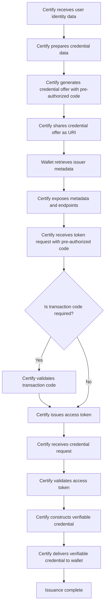
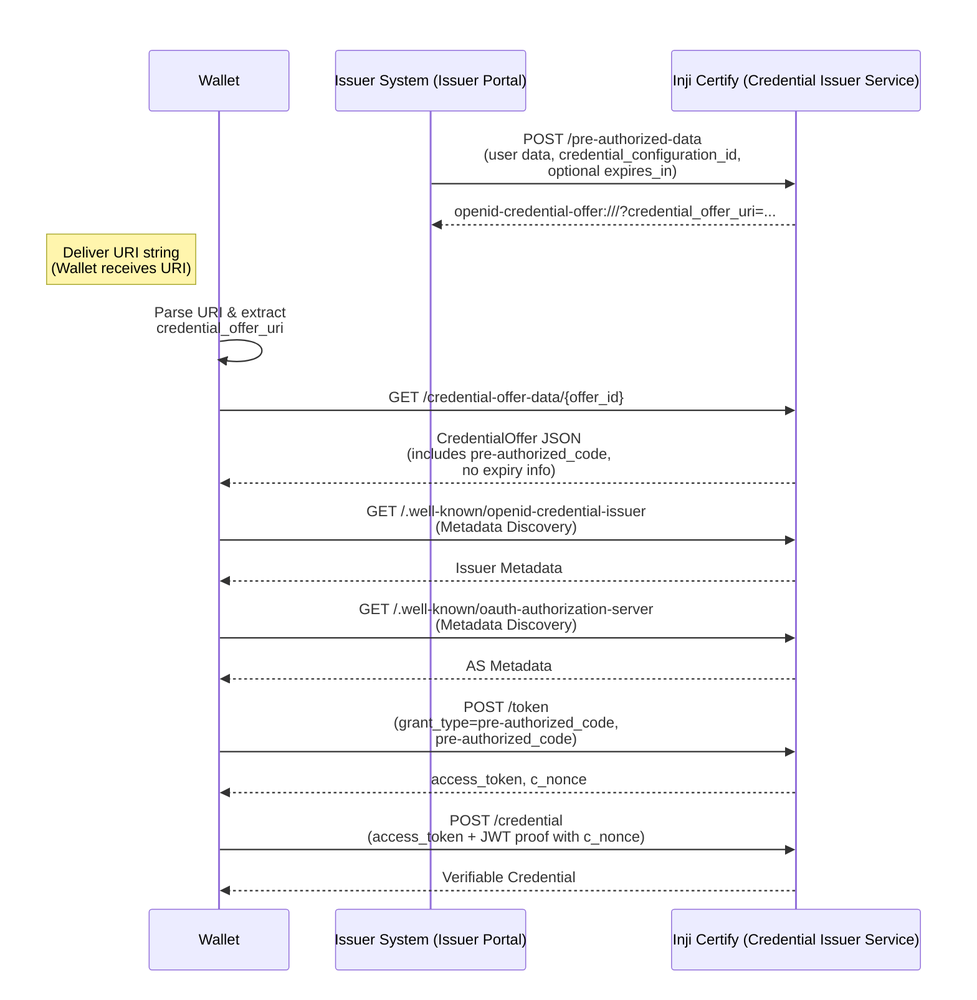

# Pre-authorized-code flow with Credential offer
The Pre-Authorized Code Flow with Credential Offer enhances the credential issuance experience by enabling wallets to obtain Verifiable Credentials (VCs) directly using a pre-authorized code embedded in a credential offer. This flow is part of the OpenID for Verifiable Credential Issuance (OpenID4VCI) standard, designed to streamline issuance where the issuer has already authenticated the user or established user context outside of the standard interactive authentication flow.

In this flow, the Credential Issuer prepares and issues a Credential Offer that contains:
 - Credential metadata
 - Issuer endpoints
 - A pre-authorized code that the wallet can exchange for an access token

The wallet then uses this pre-authorized code to securely request the VC from the issuer without requiring the user to authenticate again through a separate interactive login step.

## Need for Pre-Authorized Code Flow
1. **Seamless User Experience:** Eliminates the need for end-user interactive authentication (e.g., signing in) during VC issuance when prior authentication is already completed by the issuer.
2. **Flexible Delivery:** Credential Offers can be delivered via QR codes, deep links, or other channels, enabling both same-device and cross-device issuance experiences.
3. **Optional Transaction Code:** Issuers can require an additional user transaction code (PIN), adding an extra factor of security during issuance.
4. **Interoperability:** Aligns with OpenID4VCI standards, improving compatibility with other identity systems and wallets.

## Solution Overview
The Pre-Authorized Code Flow involves the following key steps:

1. **Certify Prepares the Credential Offer:**

    Inji Certify collects the required user claims and generates a Credential Offer containing:
   - A pre-authorized code
   - Credential metadata
   - Issuer endpoints

   The credential offer is exposed as a URI  which can be sent to the user as notification or other modes.

2. **Certify Exposes Issuer Metadata:**

    When the wallet processes the credential offer, it requests issuer metadata from Certify’s .well-known endpoint. Certify responds with discovery information, including:
   - Supported credential configurations
   - Token endpoint details
   - Credential endpoint details
   - Required parameters for token exchange

   This enables the wallet to understand how to interact with Certify for issuance.

3. **Certify Receives Token Request:**

    Certify receives a back-channel token request from the wallet at the Token Endpoint. The request includes:
   - The pre-authorized code
   - An optional transaction code (PIN), if configured

   Certify validates the pre-authorized code and, where applicable, verifies the transaction code before proceeding.

4. **Certify Issues Access Token:**

    Upon successful validation, Certify issues an access token to the wallet. This token authorizes the wallet to request the verifiable credential.

5. **Certify Issues the Verifiable Credential:**

    Certify receives a credential request from the wallet at the Credential Endpoint, secured using the access token. Certify validates the token, constructs the Verifiable Credential based on the requested configuration, and returns the issued VC to the wallet.

    The wallet then securely stores the credential for the holder’s use.

## Actors Involved
**End-User** – The individual who is being issued the credential.
**Issuer Portal** – The interface used by administrators to manage credential issuance and pre-authorization.
**Inji Certify (Issuer Service)** – The credentialing system facilitating verifiable digital credentials issuance.
**Inji Wallet** – A digital credential wallet used by the End-User to receive and store credentials securely.

## Endpoint Summary
The following endpoints are involved in the Pre-Authorized Code Flow:
1. GET `/.well-known/openid-credential-issuer`

   **Purpose:** Issuer Metadata Discovery. Allows Wallets to find essential information about the credential issuer, including the credential_endpoint, supported credential types (credential_configurations_supported), required claims for issuance, and links to the authorization server(s).

2. GET `/.well-known/oauth-authorization-server`

   **Purpose:** Authorization Server Metadata Discovery. Allows Wallets to find details about the authorization server, such as the token_endpoint, supported grant types (specifically confirming pre-authorized_grant_anonymous_access_supported), and the jwks_uri for key verification.

3. POST `/pre-authorized-data (Formerly /credential-offer)`

   **Purpose:** Initiate Credential Offer via Data Push. Allows the initiating issuer system (rather than the end-user/Wallet directly) to submit the required user data (identified by credential_configuration_id) directly to the credential issuer service (e.g., certify). The service validates the data and responds with the credential_offer_uri.

4. GET `/credential-offer-data/{offer_id} (Formerly /credential-offer/{offer_id})`

   **Purpose:** Retrieve Credential Offer via URI. Allows a Wallet to fetch a specific CredentialOffer JSON object using its unique ID. This is used when the issuance process starts with an openid-credential-offer:// URI containing a credential_offer_uri pointing to this endpoint. The response contains the pre-authorized_code.

5. POST `/token`

   **Purpose:** Obtain Access Token. The standard OAuth 2.0 Token Endpoint where the Wallet exchanges the pre-authorized_code (obtained from the Credential Offer) for a Bearer access_token and a c_nonce. This uses the urn:ietf:params:oauth:grant-type:pre-authorized_code grant type.

6. POST `/credential`

    **Purpose:** Request Verifiable Credential. The endpoint where the Wallet uses the obtained access_token (as a Bearer token) and provides a proof (a JWT signed by the Wallet's key containing the c_nonce) to request the actual Verifiable Credential from the issuer.

## Flowchart for Pre-Authorized Code Flow

## Sequence Diagram

## Limitations
1. Client Authentication is not supported. It means certify doesn't verify the client who is requesting the credential.
2. If an issuer is configured to issue Verifiable Credentials using the pre-authorised flow, other modes—such as wallet-initiated issuance—will not be supported.

## Conclusion
Implementing the Pre-Authorized Code Flow in Inji Certify enhances the credential issuance process by providing a seamless, user-friendly experience while maintaining robust security measures. This flow is particularly beneficial in scenarios where prior authorization has been granted, allowing for efficient and automated issuance of verifiable credentials.